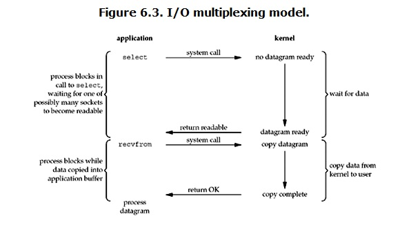

Linux环境下的网络IO ，同步IO和异步IO，阻塞IO与非阻塞IO
<!--more-->
#### 阻塞IO[Blocking IO]


#### 非阻塞IO[non-blocking IO]


#### IO复用[IO multiplexing]



#### 异步IO[Asynchronous IO]


#### 各IO间对比
![异步IO]../images/IO/IO%20compare.gif)

#### 参考
```
1.https://blog.csdn.net/historyasamirror/article/details/5778378
2.Unix网络编程[卷1 第三版 6.2 I/O模型]
```